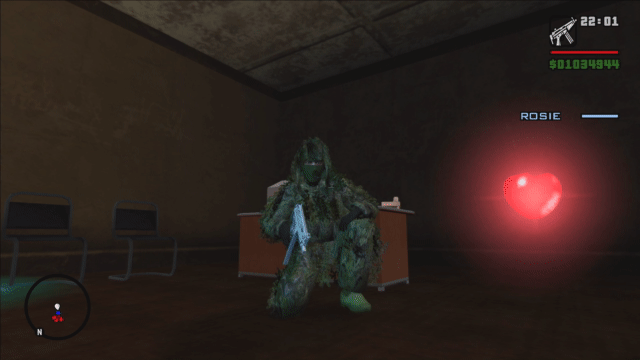

# GlowingPickupsSA
GlowingPickupsSA makes pickups glow in Grand Theft Auto: San Andreas, just like in Vice City, and Liberty City Stories (Glowing mechanism is almost the same as in Vice City Stories as well, but some corona textures are quite different).
More specifically, adds coronas for all pickups and emits lights from regular pickups in almost the same way as in Vice City.
Main differences from VC would be corona images and some additional corona colors (color filters may make you feel different about the same corona color, so be aware).

## Installation
1. Install any ASI loader
2. Put GlowingPickupsSA.asi at the right directory (Generally the game root directory or scripts folder)

## Supported versions
* v1.0 US (Hoodlum)
* v1.0 EU
* v1.01 US
* v1.01 EU

## Lisence
MIT Lisence